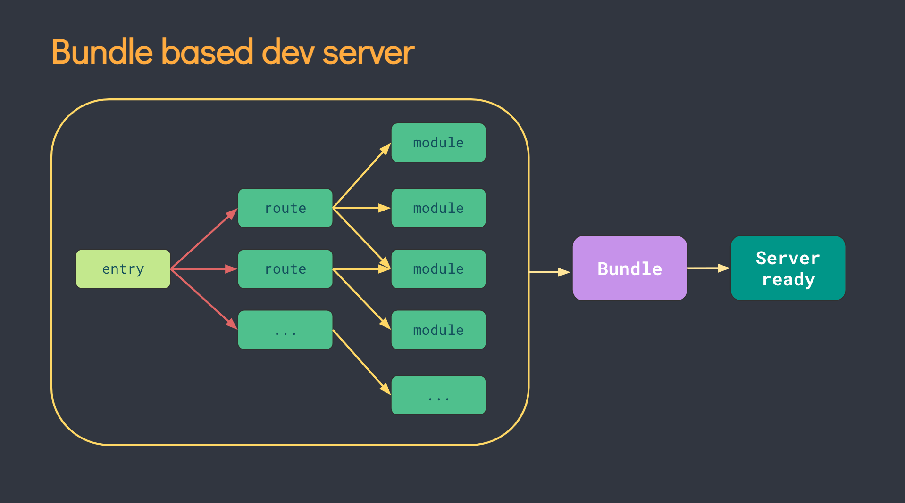

# Vite 简介 & 原理

## 简介

Vite \(法语意为 "快速的"，发音 `/vit/`\) ，是随 Vue 3.0 发布的一个前端构建工具。原先只用于 Vue 打包，2.0版本后通过插件机制去除耦合，现可用于多种框架。

官方称之为 **下一代前端开发与构建工具**，它基于非打包的思想（Bundleless），目标是提升现代前端开发的体验。本文主要简单介绍一下 Vite 的思想以及用法。

## 使用

Vite 提供了脚手架，且内置了各种主流框架的模板 \(可见 [https://github.com/vitejs/awesome-vite\#templates](https://github.com/vitejs/awesome-vite#templates%29，使得项目初始化非常方便)\)，使得项目初始化非常方便

```bash
yarn create vite
cd <project-name>
yarn
```


```text
# 启动开发服务器
yarn start

# build 
yarn build

# 本地预览
yarn serve
```

## 工作原理

### 浏览器原生支持 ES module（ESM）

Vite 能做到快的原因根本也在于此；现代浏览器已原生支持模块功能，给 script 标签增加 type="module" 的属性来标明它是一个es模块即可，浏览器会自动分析模块依赖并发起请求来加载模块

```markup
<script type="module">
  import { a } from '/a.js‘
  // ...
</script>
```

主流浏览器对ESM的支持如下：


### 去除 bundle 流程

传统的 webpack dev server 会在应用启动时分析并构建整个应用



Vite 在开发环境以原生 ESM 的形式来加载代码，有以下优点：

* 将合并 bundle 的工作交给了浏览器，其次能按需引用代码，只有代码被使用时会被加载；
* 利用缓存：将 node\_modules 下模块用强缓存方式、源码模块用协商缓存方式 来提高性能
* 更快的热更新，不受 bundle 大小影响


如图，经过 Vite 处理后，模块均被转换为 ESM 模块被浏览器直接使用，而不是传统的 bundle 模式


### NPM 预构建与依赖解析

如果完全不做处理，仅仅做文件代理也是会有问题的：

1. 很多 npm 包只提供了CommonJS 版本，无法用 ESM 方式载入（react、lodash等）
2. 很多依赖如  `import { debounce } from 'lodash-es'` ，debounce 内部又引用了其他函数，会导致需要加载的模块数过多，请求数过多

Vite 在项目启动时，预先做了依赖分析，对 node\_modules 依赖做了预处理：

* 分析模块依赖关系，使用 esbuild 打包（会把 commonJS 也转换成 ESM模块），将单模块依赖合并成一个文件，并缓存至 node\_modules/.vite/ 下， [https://github.com/vitejs/vite/blob/ed16488591b7dfac7e54d96f67c6f3674368b0cc/packages/vite/src/node/plugins/esbuild.ts\#L82](https://github.com/vitejs/vite/blob/ed16488591b7dfac7e54d96f67c6f3674368b0cc/packages/vite/src/node/plugins/esbuild.ts#L82)

（可以看到esbuild编译速度是非常惊人的 [https://github.com/evanw/esbuild\#why）](https://github.com/evanw/esbuild#why）)


### 裸模块导入

如图可以看到 Vite 对 `import react from 'react'` 做了处理：

* 一是因为目前浏览器不支持形如 'react' 依赖的直接引用（浏览器没有在node\_modules里寻找依赖的机制）
* 二是 Vite 对npm 依赖做了预编译，可以直接到缓存中去读取


## 热更新

### client

处理 server websocket 发过来的信号[https://github.com/vitejs/vite/blob/5c0f0a362f669e3d38ddc51bfdd9d424a7c08feb/packages/vite/src/client/client.ts\#L50](https://github.com/vitejs/vite/blob/5c0f0a362f669e3d38ddc51bfdd9d424a7c08feb/packages/vite/src/client/client.ts#L50)

### server

监听文件改变触发handleHMRUpdate [https://github.com/vitejs/vite/blob/main/packages/vite/src/node/server/index.ts\#L414](https://github.com/vitejs/vite/blob/main/packages/vite/src/node/server/index.ts#L414)

```typescript
  watcher.on('change', async (file) => {
    file = normalizePath(file)
    // invalidate module graph cache on file change
    moduleGraph.onFileChange(file)
    if (serverConfig.hmr !== false) {
      try {
        await handleHMRUpdate(file, server)
      } catch (err) {
        ws.send({
          type: 'error',
          err: prepareError(err)
        })
      }
    }
  })
```

遍历插件处理热更新[https://github.com/vitejs/vite/blob/5c0f0a362f669e3d38ddc51bfdd9d424a7c08feb/packages/vite/src/node/server/hmr.ts\#L89](https://github.com/vitejs/vite/blob/5c0f0a362f669e3d38ddc51bfdd9d424a7c08feb/packages/vite/src/node/server/hmr.ts#L89)

```typescript
  for (const plugin of config.plugins) {
    if (plugin.handleHotUpdate) {
      const filteredModules = await plugin.handleHotUpdate(hmrContext)
      if (filteredModules) {
        hmrContext.modules = filteredModules
      }
    }
  }
```

websocket send update 信号给 client [https://github.com/vitejs/vite/blob/5c0f0a362f669e3d38ddc51bfdd9d424a7c08feb/packages/vite/src/node/server/hmr.ts\#L121](https://github.com/vitejs/vite/blob/5c0f0a362f669e3d38ddc51bfdd9d424a7c08feb/packages/vite/src/node/server/hmr.ts#L121)

```typescript
  if (needFullReload) {
    config.logger.info(chalk.green(`page reload `) + chalk.dim(file), {
      clear: true,
      timestamp: true
    })
    ws.send({
      type: 'full-reload'
    })
  } else {
    config.logger.info(
      updates
        .map(({ path }) => chalk.green(`hmr update `) + chalk.dim(path))
        .join('\n'),
      { clear: true, timestamp: true }
    )
    ws.send({
      type: 'update',
      updates
    })
  }
```

## 插件机制

Vite 基于 Rollup 插件接口进行扩展，扩展了一些钩子，意味着 Vite 可以享用大部分 Rollup 优质的插件库（vite 多了一些钩子，不一定完全兼容）

* api 文档    [https://cn.vitejs.dev/guide/api-plugin.html](https://cn.vitejs.dev/guide/api-plugin.html)

Vite 预置了一些插件，可开箱即用，可以看

```typescript
export function resolveBuildPlugins(config: ResolvedConfig): {
  pre: Plugin[]
  post: Plugin[]
} {
  const options = config.build
  return {
    pre: [
      buildHtmlPlugin(config),
      commonjsPlugin(options.commonjsOptions),
      dataURIPlugin(),
      dynamicImportVars(options.dynamicImportVarsOptions),
      assetImportMetaUrlPlugin(config),
      ...(options.rollupOptions.plugins
        ? (options.rollupOptions.plugins.filter((p) => !!p) as Plugin[])
        : [])
    ],
    post: [
      buildImportAnalysisPlugin(config),
      buildEsbuildPlugin(config),
      ...(options.minify && options.minify !== 'esbuild'
        ? [terserPlugin(options.terserOptions)]
        : []),
      ...(options.manifest ? [manifestPlugin(config)] : []),
      ...(options.ssrManifest ? [ssrManifestPlugin(config)] : []),
      buildReporterPlugin(config),
      loadFallbackPlugin()
    ]
  }
}
```

[https://github.com/vitejs/vite/blob/main/packages/vite/src/node/build.ts\#L275](https://github.com/vitejs/vite/blob/main/packages/vite/src/node/build.ts#L275)\)

插件使用：

```javascript
import { defineConfig } from 'vite'
import reactRefresh from '@vitejs/plugin-react-refresh'
// 兼容性插件
import legacy from '@vitejs/plugin-legacy'

// https://vitejs.dev/config/
export default defineConfig({
  plugins: [
    reactRefresh(),
    legacy({
      targets: ['defaults', 'not IE 11']
    })]
})
```

## 兼容性

兼容性方面，官方也提供插件 [@vitejs/plugin-legacy](https://github.com/vitejs/vite/tree/main/packages/plugin-legacy) 支持

如上图，插件工作原理是：打包两份产物，一份使用ESM特性的产物，一份不使用ESM特性的产物，不支持ESM的浏览器会走到下面 nomodule 的逻辑


## 比较

### Snowpack

* Vite 灵感来自于 Snowpack，两者在工作原理上十分相似
* Vite 插件基于 Rollup 扩展，社区更活跃；Snowpack 是自定义的插件机制，社区相对不完善
* 生产环境打包方面   Vite 绑定了 Rollup，而 Snowpack 支持Rollup、webpack，但构建由用户自己控制，可能会与开发环境存在不同

### WMR

* 为 Preact 定制，如果做 Preact 开发可优先使用

